## nsys-llm-explainer

[](https://github.com/KOKOSde/nsys-llm-explainer/actions/workflows/ci.yml)




### Why this exists

Nsight Systems SQLite exports are powerful but tedious to inspect by hand when you need an answer quickly.

This tool turns `trace.sqlite` into a prioritized report with explicit evidence:

- Top CUDA kernels and launch storms
- Top CPU↔GPU barriers, including blocking memcpy and CPU launcher gaps
- Top NCCL ops, with overlap against non-NCCL compute kernels
- Per-process breakdowns for vLLM-style multi-process traces
- NVLink during NCCL when NVLink counters are present
- Exact capture instructions when required counters are missing

The repo is intentionally conservative:

- It only claims NCCL/NVLink correlation when the exported SQLite data supports it.
- If NVLink counters are missing, it prints `NVLink counters not found` and tells you exactly how to re-capture.
- If only NCCL kernel names are available, it degrades to kernel-name-based NCCL detection instead of pretending it saw higher-level collectives.

### New: NCCL + NVLink + Barrier analysis

The fastest way to verify the current report shape is the committed synthetic example:

- Example report with all current section headers: [examples/synthetic/report.md](examples/synthetic/report.md)
- The example is generated from the synthetic SQLite fixture in `tests/test_synthetic_sqlite.py`, so it is small and reproducible.
- Exact visible section names:
  `Global critical path suspects`, `Top NCCL ops`, `NVLink during NCCL`, `Top CPU↔GPU barriers`, `Per-process breakdown`
- If the report says `NVLink counters not found`, jump to [NVLink counters guidance](#3-nvlink-counters-guidance) for the re-capture command.

### Install

```bash
python3 -m pip install -e .
```

For tests:

```bash
python3 -m pip install -e .[dev]
```

### Run

```bash
nsys-llm-explain trace.sqlite --out artifacts/run_YYYYMMDD_HHMMSS/
```

Useful flags:

- `--print-schema`: dump the detected SQLite tables/columns first
- `--phase-map phases.json`: optional NVTX phase grouping

### What the report includes

The generated output directory contains:

- `report.md`, `report.json`
- `tables/kernels.csv`
- `tables/barriers.csv`
- `tables/nccl_ops.csv`
- `tables/nccl_by_pid.csv`
- `tables/nvlink_during_nccl.csv`
- `tables/gpu_idle_gaps.csv`
- `tables/kernels_by_pid.csv`, `tables/sync_by_pid.csv`, `tables/nvtx_by_pid.csv`

New report sections:

- `Global critical path suspects`
- `Top NCCL ops`
- `NVLink during NCCL`
- `Top CPU↔GPU barriers`
- `Per-process breakdown`

### Capture recipes

#### 1. Vanilla CUDA workloads

Use this when you want kernels, launch gaps, barriers, NVTX, and CUDA-graphs-aware capture:

```bash
nsys profile \
  --trace=cuda,nvtx,osrt \
  --sample=none \
  --cpuctxsw=none \
  --cuda-trace-scope=process-tree \
  --cuda-graph-trace=node \
  -o trace \
  python your_workload.py

nsys export \
  --type sqlite \
  --output trace.sqlite \
  --force-overwrite=true \
  --lazy=false \
  trace.nsys-rep

nsys-llm-explain trace.sqlite --out artifacts/run_YYYYMMDD_HHMMSS/
```

Notes:

- `--cuda-trace-scope=process-tree` keeps child processes in the trace, which matters for vLLM-style worker processes.
- `--cuda-graph-trace=node` is recommended when the workload uses CUDA Graphs.

#### 2. NCCL multi-process / multi-node

Use this when you want NCCL ops to survive export cleanly:

```bash
nsys profile \
  --trace=nccl,cuda,nvtx,osrt \
  --nccl-trace=all \
  --sample=none \
  --cpuctxsw=none \
  --cuda-trace-scope=process-tree \
  --cuda-graph-trace=node \
  -o trace \
  torchrun --nproc_per_node=... your_workload.py

nsys export \
  --type sqlite \
  --include-json true \
  --output trace.sqlite \
  --force-overwrite=true \
  --lazy=false \
  trace.nsys-rep
```

Why `--include-json true` matters:

- Nsight Systems exports some event classes, including NVTX events with user-defined payloads, only when JSON export is included.
- Recent NCCL tracing support in Nsight Systems surfaces NCCL activity as NVTX-backed events in the exported database.

This tool will still fall back to runtime API names or NCCL kernel names when those richer NCCL events are absent.

#### 3. NVLink counters guidance

The tool can only report `NVLink during NCCL` when the SQLite export contains GPU Metrics tables with NVLink-related metrics.

First, list the supported GPU metric sets on your machine:

```bash
nsys profile --gpu-metrics-devices=all --gpu-metrics-set=help
```

Then re-capture with a supported metric set:

```bash
sudo nsys profile \
  --trace=nccl,cuda,nvtx,osrt \
  --nccl-trace=all \
  --sample=none \
  --cpuctxsw=none \
  --cuda-trace-scope=process-tree \
  --cuda-graph-trace=node \
  --gpu-metrics-devices=all \
  --gpu-metrics-set=<supported-set> \
  --gpu-metrics-frequency=10000 \
  -o trace \
  torchrun --nproc_per_node=... your_workload.py

nsys export \
  --type sqlite \
  --include-json true \
  --output trace.sqlite \
  --force-overwrite=true \
  --lazy=false \
  trace.nsys-rep
```

Notes:

- On Linux, GPU Metrics collection typically requires elevated permissions.
- When those counters are missing, the report prints `NVLink counters not found` instead of inventing a correlation result.

### Sample output

The snippets below are generated from the synthetic SQLite fixture used in tests, not from a real GPU capture.

CLI sample:

```text
Wrote report to: /tmp/.../out/report.md
Top kernel: computeKernel (42.6% of kernel time, 2.6 ms, 3 calls)
Top barrier: cudaStreamSynchronize [sync_api] (0.8 ms, 1 events)
Top NCCL op: allreduce (2.0 ms total, 2.0 ms max, overlap 50.0%)
Launch storm: 5 launches over 0.005s = 909.1 launches/s; median kernel 1000.00 us
GPU idle estimate: GPU 0: 18.2% idle (1.0 ms / 5.5 ms window)
NVLink during NCCL: NVLink counters not found
```

Report sample:

```text
## Global critical path suspects
| kind | name | total_ms | count | details |
| kernel | computeKernel | 2.600 | 3 | 42.6% of kernel time |
| nccl | allreduce | 2.000 | 1 | max 2.000 ms |

## Top NCCL ops
| op_name | source | total_time_ms | max_duration_ms | count | compute_overlap_ms | compute_overlap_pct | straggler |
| allreduce | kernel | 2.000 | 2.000 | 1 | 1.000 | 50.0 | pid:111 |
| broadcast | kernel | 1.500 | 1.500 | 1 | 0.600 | 40.0 | pid:222 |

## Top CPU↔GPU barriers
| barrier_kind | api_name | total_time_ms | count | avg_duration_us | max_duration_us |
| sync_api | cudaStreamSynchronize | 0.800 | 1 | 800.00 | 800.00 |
| sync_api | cudaDeviceSynchronize | 0.700 | 1 | 700.00 | 700.00 |
| blocking_memcpy | cudaMemcpy | 0.600 | 1 | 600.00 | 600.00 |
| cpu_launcher_gap | cpu_launcher_gap | 0.200 | 1 | 200.00 | 200.00 |
```

When NVLink metrics are present, the synthetic fixture produces a row like:

```text
metric_source_id: 0
metric_names: NVLink bytes received, NVLink bytes transmitted
avg_metric_during_nccl: 76.67
avg_metric_outside_nccl: 5.83
nccl_activity_correlation: 0.990
```

### Committed examples

- [examples/synthetic/report.md](examples/synthetic/report.md): synthetic, fixture-generated, and guaranteed to show the new NCCL/NVLink/barrier/per-process sections.
- `examples/a100_vllm/`: historical real output-only example from an A100 vLLM run.

### Schema compatibility

Nsight Systems SQLite schema varies by version and by capture options.

This tool probes the schema at runtime and degrades gracefully:

- String table: prefers `StringIds(id, value)`
- Kernels: prefers `CUPTI_ACTIVITY_KIND_KERNEL`, falls back to concurrent-kernel variants
- Runtime API: prefers `CUPTI_ACTIVITY_KIND_RUNTIME`
- NVTX: prefers `NVTX_EVENTS`
- GPU Metrics: looks for `GPU_METRICS` and `TARGET_INFO_GPU_METRICS`
- CUDA Graphs capture awareness: the README and report assume `--cuda-graph-trace=node` for graph-heavy workloads

If a section cannot be computed, the report says so explicitly instead of silently omitting the limitation.

### Reproduce locally

Install:

```bash
python3 -m pip install -e .[dev]
```

Run on a trace:

```bash
nsys-llm-explain trace.sqlite --out artifacts/run_YYYYMMDD_HHMMSS/
```

Run tests:

```bash
python3 -m pytest -q
```

### References

Primary NVIDIA documentation used for the capture/export guidance:

- Nsight Systems User Guide: GPU metrics collection, `--gpu-metrics-set=help`, and required permissions
- Nsight Systems User Guide: `--cuda-graph-trace=node`
- Nsight Systems User Guide: `--cuda-trace-scope=process-tree`
- Nsight Systems User Guide: NCCL tracing and `--nccl-trace=all`
- Nsight Systems User Guide: SQLite export `--include-json true`
